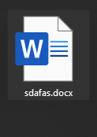
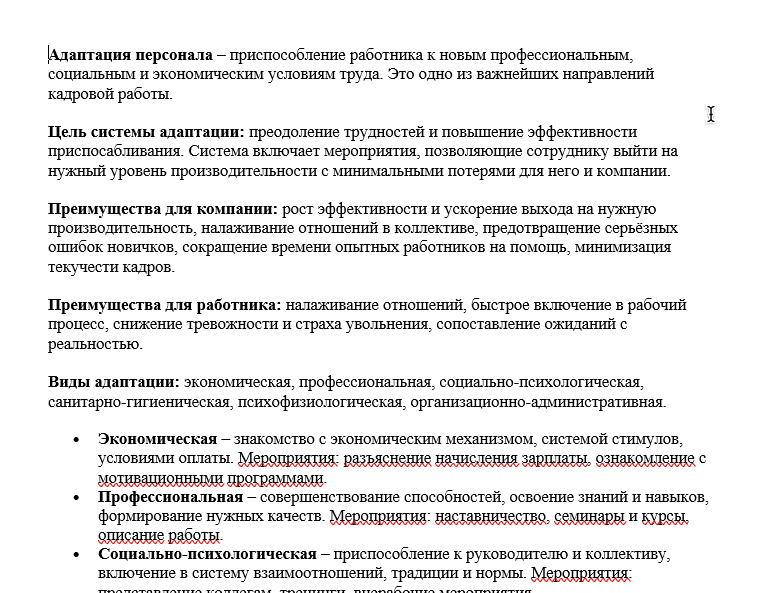
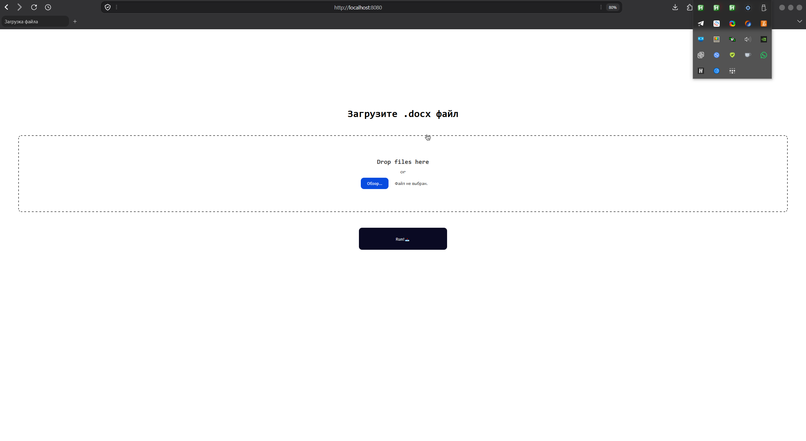
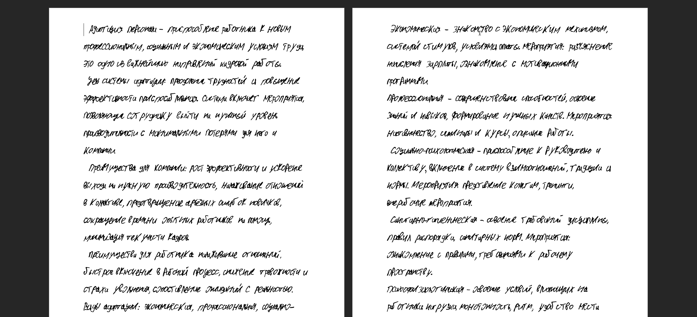
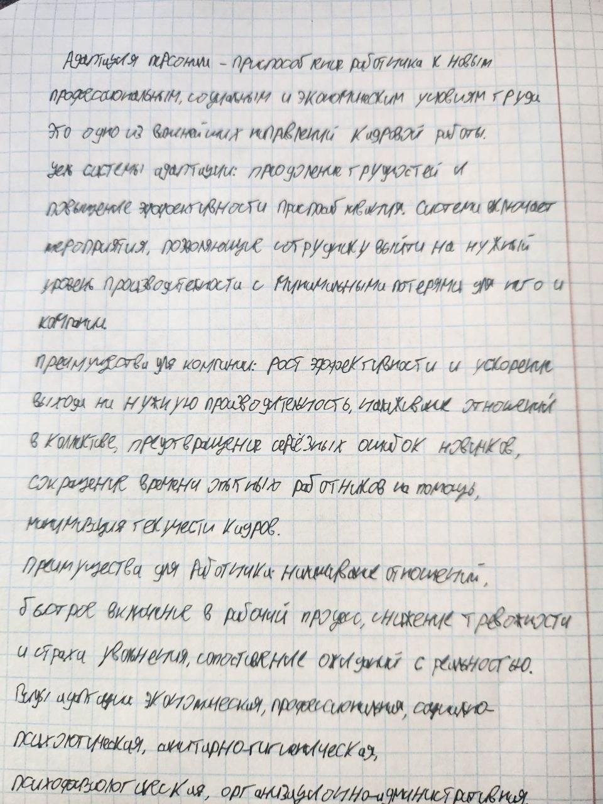

# ✍️ Spectfaker

> ⚠️ **ВАЖНО**: проект для личного пользования, без претензий на production


Никакого production-ready, никакой науки, никаких претензий.

Это генератор, который превращает текст из `.docx` в документ, набранный моим рукописным шрифтом, с живыми неровностями 🤷

## 🤔 Зачем это вообще

### Переписывать конспекты к своим руками - жутко скучное занятие
### Написать программу, которая сделает это за меня, - уже другое дело :))

## 🛠️ Как это работает

Spring Boot приложение: кидаешь `.docx` через веб-форму
→ получаешь обратно тот же текст, но типа «от руки»

📄➡️✍️

## Алгоритм:

1. 📝 Вытаскиваем весь текст из загруженного docx
2. 🧹 Полностью чистим документ
3. 🎲 Каждую букву обрабатываем отдельно и **по-разному**:
    - 🎨 случайный шрифт из набора моих рукописных (PavelFont 1–8 для русских, ENG 1–2 для латиницы)
    - 📈 **размер шрифта** - плавная «волна» 18.3–20.2pt с инерцией + микро-дрожание
    - ↔️ **межбуквенный интервал** - тесный, тоже волной (-38..-20), без резких скачков
    - ↕️ **вертикальный сдвиг** букв ±3 полупункта — строка «пляшет», как живая
    - ✏️ пунктуация и цифры чуть меньше основного текста
4. 📏 Межстрочный интервал `EXACT` 566–568 твипов — ровно по клеткам тетради 📓
5. ➡️ Первая строка абзаца с отступом (3–5 пробелов), между словами 2–3 пробела — как у человека
6. 🖨️ Отдаём файл обратно — остаётся только распечатать 🎓


# Как я этим пользуюсь

## Предположим, что у нас есть файл лекции:

<p align="center"></p>

## Примерно следующего кучерявого характера

<p align="center"></p>

## После этого можно загрузить его через эту форму

<p align="center"></p>

## Далее, после отработки программы, мы получаем подобную кривую гадость

<p align="center"></p>

### Далее мы правим косяки и конвертим в .pdf 

## В конечном итоге, после настроек печати в Adobe Acrobat мы получаем что-то типа того:

<p align="center"></p>

--- 

### Как профит мы получаем то, что можно не писать конспекты руками ВАЩЕ :)
### Пользуюсь этим с середины второго курса колледжа

# 🔬 Что тут интересного технически

- **Apache POI** (XWPF): чтение и полная пересборка `.docx` без Word
- **Посимвольная работа с runs**: каждая буква — отдельный run со своим шрифтом, размером, кернингом и вертикальной позицией
- **«Естественный» разброс без резких скачков**: параметры меняются волной с инерцией плюс мелкий шум, а не чистым рандомом, поэтому текст не выглядит как мусор
- **Сетка тетради**: точный межстрочный интервал (`EXACT`, твипы) под клетку

# 🚀 Запуск

Нужны: Java 21 ☕ и Maven

```bash
./mvnw spring-boot:run
``` 

